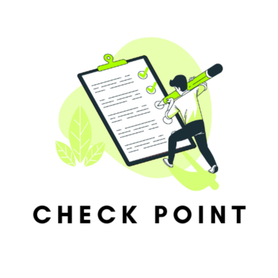
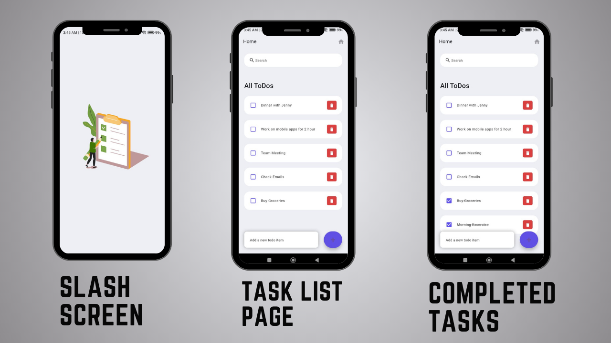

<br>
<p align="center">
    <a herf="https://future-insight.blog/">
    
    </a>
  <br>
</p>

<h1 align="center">
    Hi there
    
     Welcome to Check Point Application
</h1>
Welcome to Check Point – your passport to productivity! Crafted with Flutter, the Check Point App is your ultimate wingman in mastering the art of task management. Seamlessly create and conquer your to-do list with finesse, empowering you to navigate life's hustle effortlessly.

<br>
<br>
<div style="display: flex; justify-content: center;">
  <div style="justify-content: center; align-items: center; border-radius: 10px; overflow: hidden; box-shadow: 0 2px 10px rgba(0, 0, 0, 0.2);">
    
  </div>
</div>
<br>
<br>

## Project Structure
- **lib/main.dart**: Entry point of the application, housing the main() method and app initialization.
- **lib/src**: Core source code directory.
    - **screens/**: Hosts UI screens of the application.
        - **splash.dart**: Splash screen displayed upon app launch.
        - **home.dart**: Primary home screen featuring the list of todos.
    - **widgets/**: Collection of reusable UI components.
        - **app_bar.dart**: Customized app bar widget.
        - **search_box.dart**: Integrated search box widget.
        - **todo_task.dart**: Widget responsible for displaying a single todo task.
    - **constants/**: Centralized location for app constants like color palettes.
    - **models/**: Contains data model classes defining the structure of the app's data.
- **pubspec.yaml**: Management file for dependencies and assets within the project.
- **test/**: Dedicated directory for unit and widget tests.

## Features
- **Animated Splash Screen**: Engaging introduction to the app upon startup.
- **Home Screen**: Central area to view and manage the list of to-do tasks.
- **Search Bar**: Facilitates quick task filtering based on user input.
- **Task Management**: Functions to add, edit, and delete tasks effortlessly.
- **Local Storage Persistence**: Ensures tasks remain accessible across app sessions.
- **Testing Suite**: Includes unit and widget tests for maintaining app stability and performance.

# Getting Started
To execute the app, follow these steps:

1. Run the commands below in the terminal:
    ```
    flutter pub get
    flutter run
    ```
    This will install necessary dependencies and initiate the app on a connected device or emulator.

## Testing
### Running Tests:
Execute the command:
```
flutter test
```
This will run the complete suite of unit and widget tests.

## Building
To generate a release build of the app for a specific platform, use the following command:
```
flutter build <platform> 
```
Replace `<platform>` with the desired target (e.g., apk, ios, web). This will produce a release-ready build stored in the build/ directory.

### Pre-built APK
A pre-built APK file is available, allowing you to easily try out the application. Simply download the file and install the application on your system.

# Contact 
Email: [99marafay@gmail.com](mailto:99marafay@gmail.com)
Organization: [Future Insight](https://future-insight.blog/)

If you have any Problem regarding this Project then free will to contact me. 
Developed with Love using Flutter. 